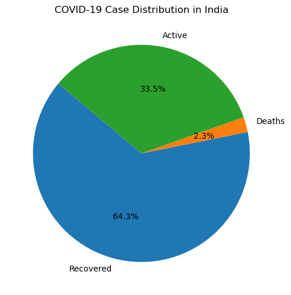
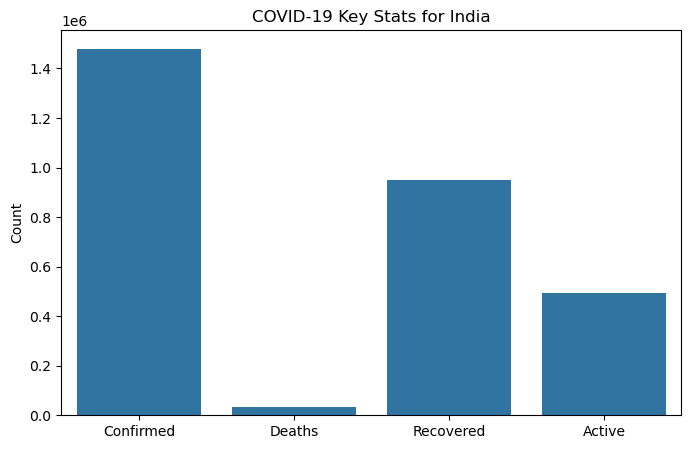

```markdown
---

# COVID-19 Data Analysis — Country-wise Overview

[](https://www.python.org/)
[](https://jupyter.org/)
[](https://pandas.pydata.org/)
[](https://seaborn.pydata.org/)

---

## 📊 Project Overview

This project analyzes COVID-19 country-wise data to extract meaningful insights and visualize trends.  
It covers data cleaning, manipulation, and visualization using Python libraries like Pandas, NumPy, Matplotlib and Seaborn.

---

## 🚀 Features

* Data cleaning & preprocessing  
* Exploratory Data Analysis (EDA)  
* Visualizations including:  
  * Correlation pairplots  
  * Trend analysis for confirmed, deaths, recovered cases  
  * Country-specific insights (e.g., India)  
* Advanced analysis on new cases and death rates  

---

## 🛠️ Technologies & Libraries

* Python 3.8+  
* Jupyter Notebook  
* Pandas  
* NumPy  
* Matplotlib  
* Seaborn  

---

## 🗂️ Dataset

* Source: [Kaggle - COVID-19 Dataset](https://www.kaggle.com/datasets/imdevskp/corona-virus-report)  
* Format: CSV file with columns such as Country/Region, Confirmed, Deaths, Recovered, Active, New cases, New deaths, etc.

---

## 📂 Repository Structure

```

covid19-analysis/
│
├── data/                 # Dataset files
│   └── country_wise_latest.csv
│
│
├── covid_analysis.ipynb  
│
├── requirements.txt      # Required Python libraries
│
└── README.md             # Project documentation

````

---

## 📊 Sample Visualizations

### COVID-19 Case Distribution in India



### COVID-19 Trends in India (Confirmed, Deaths, Recovered, Active)



---

## 💡 How to Run

1. Clone the repo:

   ```bash
   git clone https://github.com/Satyaamp/covid19-analysis.git
   cd covid19-analysis
````

2. Install dependencies:

   ```bash
   pip install -r requirements.txt
   ```

3. Open the Jupyter Notebook:

   ```bash
   jupyter notebook covid_analysis.ipynb
   ```

---

## 📈 Key Insights

* Overview of COVID-19 cases globally
* Detailed analysis for India with visualizations
* Correlations between confirmed, deaths, recovered, and active cases
* Trends and patterns in new cases and deaths

---

## 🤝 Contributions

Feel free to open issues or submit pull requests to improve the analysis or add new features!

---

## 📞 Contact

**Satyam Kumar**
Email: [cbse821@gmail.com](mailto:cbse821@gmail.com)
LinkedIn: [https://www.linkedin.com/in/satyaamp/](https://www.linkedin.com/in/satyaamp/)

---

*Stay safe and keep learning!*

---

```
